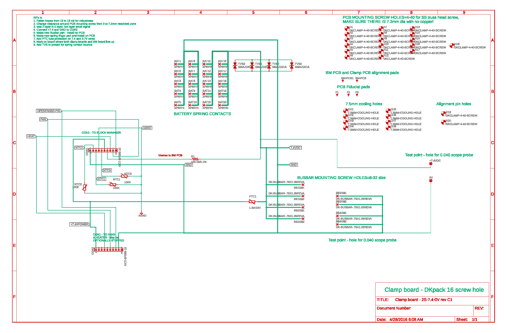
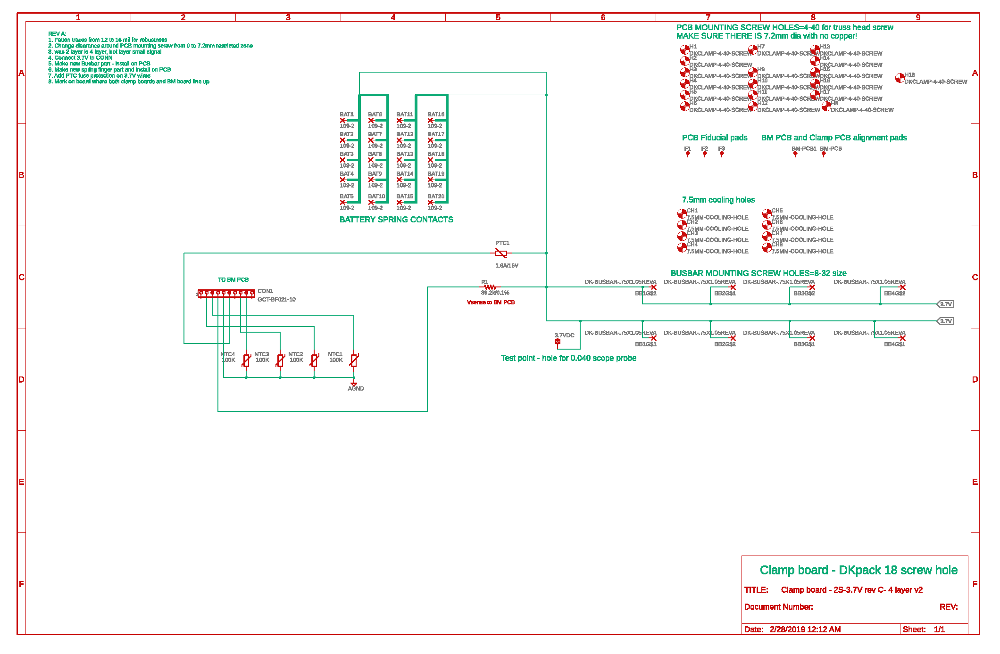

# Clamp Board PCBs
### Hardware Files For The Dkblock Clamp Board 7.4V and 3.7V
These are the printed circuit board (PCB) files, CAD files, specification sheets and all technical drawings needed to make the DKblock Clamp board. Note that the bill of materials (BOM) and other technical documents can be opened in [OpenOffice](https://www.openoffice.org) format and PCB files are in [EAGLE](https://www.autodesk.com/products/eagle/overview) format.
One version is provided, Rev C is a fully tested board, put into limited production and used on a 72VDC electric scooter named Fido, and a 150VDC VW bug conversion. 
Also note that the cells have fuse protection on each cell. See "Blowup of trace fuse with comments.pdf" graphic

All DKblock software and hardware is released as open source hardware (OSHW) as defined by the OSHWA: https://www.oshwa.org/definition/ and under the JSON license defined at https://www.json.org/license.html
